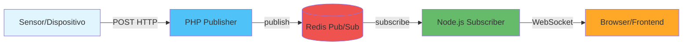
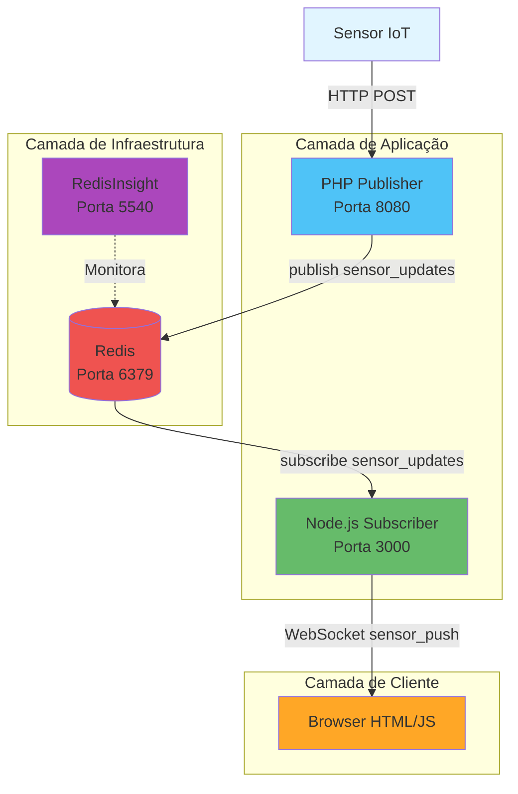
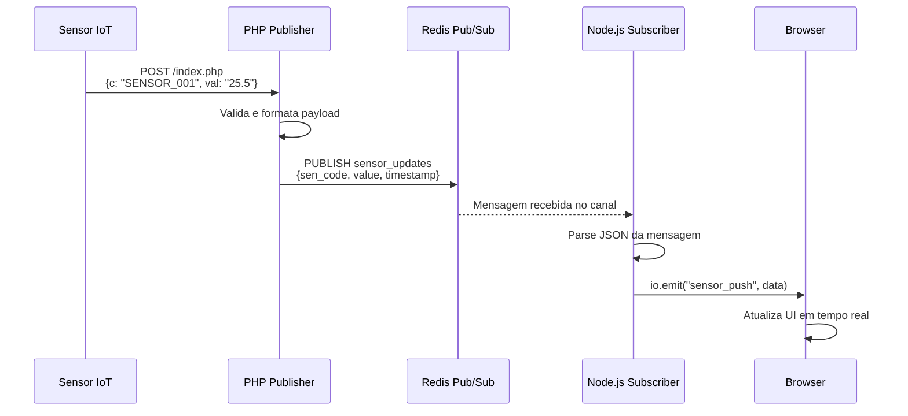

# IoT Real-time Pub/Sub com Redis

Sistema de monitoramento IoT em tempo real utilizando o padrão **Pub/Sub** com Redis como message broker. Este projeto demonstra como desacoplar publishers (publicadores) e subscribers (assinantes) usando Redis Pub/Sub, distribuindo dados de sensores para múltiplos clientes via WebSocket.

## 📋 Índice

- [Visão Geral](#visão-geral)
- [Arquitetura](#arquitetura)
- [Tecnologias Utilizadas](#tecnologias-utilizadas)
- [Pré-requisitos](#pré-requisitos)
- [Instalação e Execução](#instalação-e-execução)
- [Estrutura do Projeto](#estrutura-do-projeto)
- [Como Usar](#como-usar)
- [Arquitetura Detalhada](#arquitetura-detalhada)
- [Exemplos Práticos](#exemplos-práticos)
- [Troubleshooting](#troubleshooting)
- [Desenvolvimento](#desenvolvimento)
- [Melhorias Futuras](#melhorias-futuras)

## 🎯 Visão Geral

Este projeto implementa um sistema de **Pub/Sub (Publish/Subscribe)** onde:

- **PHP** atua como **Publisher**: recebe dados de sensores via HTTP POST e publica no Redis
- **Node.js** atua como **Subscriber**: assina mensagens do Redis e distribui via WebSocket
- **Redis** funciona como **Message Broker**: desacopla publishers e subscribers
- **Frontend HTML** consome dados em tempo real via WebSocket

### Fluxo de Dados



## 🏗️ Arquitetura

### Padrão Pub/Sub

O padrão **Publish/Subscribe** permite que:

- **Publishers** (publicadores) enviem mensagens sem conhecer os subscribers
- **Subscribers** (assinantes) recebam mensagens sem conhecer os publishers
- **Message Broker** (Redis) gerencia a distribuição de mensagens

### Componentes Principais

1. **Redis**: Message broker in-memory com suporte nativo a Pub/Sub
2. **PHP App**: Servidor HTTP que recebe dados e publica no Redis
3. **Node.js WebSocket**: Servidor que assina Redis e distribui via Socket.IO
4. **Frontend**: Interface web que recebe atualizações em tempo real
5. **RedisInsight**: Ferramenta de monitoramento e visualização do Redis

### Diagrama de Arquitetura Completa



## 🛠️ Tecnologias Utilizadas

| Tecnologia | Versão | Propósito |
|------------|--------|-----------|
| **Docker** | Latest | Containerização e orquestração |
| **Docker Compose** | Latest | Orquestração de múltiplos containers |
| **Redis** | Alpine | Message broker Pub/Sub |
| **PHP** | 8.2 | Publisher (recebe dados HTTP) |
| **Node.js** | 20 | Subscriber (WebSocket server) |
| **Socket.IO** | 4.7.2 | Biblioteca WebSocket para Node.js |
| **Redis Client** | 4.6.7 | Cliente Redis para Node.js |
| **RedisInsight** | Latest | Interface de monitoramento Redis |

### Por que essas escolhas?

- **PHP**: Ideal para receber requisições HTTP simples de sensores, leve e eficiente
- **Node.js**: Excelente para conexões WebSocket persistentes, I/O não-bloqueante
- **Redis**: Pub/Sub nativo, baixa latência, amplamente utilizado
- **Docker**: Isolamento, portabilidade e facilidade de deploy

## 📦 Pré-requisitos

- **Docker** >= 20.10
- **Docker Compose** >= 2.0
- **Git** (para clonar o repositório)

### Verificar Instalação

```bash
docker --version
docker-compose --version
```

## 🚀 Instalação e Execução

### 1. Clonar o Repositório

```bash
git clone <url-do-repositorio>
cd lab-realtime-pubsub
```

### 2. Executar com Docker Compose

```bash
docker-compose up --build
```

Este comando irá:
- Construir as imagens dos containers PHP e Node.js
- Iniciar todos os serviços (Redis, RedisInsight, PHP, Node.js)
- Criar a rede Docker para comunicação entre serviços
- Criar volume persistente para dados do Redis

### 3. Verificar Serviços

Após a execução, os seguintes serviços estarão disponíveis:

| Serviço | URL | Descrição |
|---------|-----|-----------|
| PHP App | http://localhost:8080 | Endpoint para receber dados de sensores |
| Node.js WS | http://localhost:3000 | Servidor WebSocket |
| RedisInsight | http://localhost:5540 | Interface de monitoramento |
| Redis | localhost:6379 | Message broker (interno) |

### 4. Acessar o Frontend

Abra o arquivo `index.html` no navegador ou sirva via servidor HTTP local:

```bash
# Opção 1: Abrir diretamente
open index.html

# Opção 2: Servir com Python
python3 -m http.server 8000
# Acesse: http://localhost:8000
```

### 5. Parar os Serviços

```bash
docker-compose down
```

Para remover também os volumes:

```bash
docker-compose down -v
```

## 📁 Estrutura do Projeto

```
lab-realtime-pubsub/
├── docker-compose.yml          # Orquestração de todos os serviços
├── index.html                  # Frontend que recebe atualizações
├── README.md                   # Esta documentação
│
├── php/                        # Serviço Publisher
│   ├── Dockerfile              # Imagem Docker PHP
│   └── index.php               # Endpoint que recebe e publica dados
│
└── node/                       # Serviço Subscriber
    ├── Dockerfile              # Imagem Docker Node.js
    ├── package.json            # Dependências Node.js
    └── server.js               # Servidor WebSocket que assina Redis
```

### Descrição dos Arquivos

#### `docker-compose.yml`
Orquestra todos os serviços, define rede Docker, volumes e portas expostas.

#### `index.html`
Frontend simples que se conecta ao WebSocket e exibe dados em tempo real.

#### `php/index.php`
Endpoint HTTP que:
- Recebe POST com dados do sensor (`c` = código, `val` = valor)
- Conecta ao Redis
- Publica mensagem no canal `sensor_updates`
- Retorna confirmação JSON

#### `node/server.js`
Servidor Node.js que:
- Cria servidor Socket.IO na porta 3000
- Conecta ao Redis
- Assina o canal `sensor_updates`
- Distribui mensagens recebidas via WebSocket como evento `sensor_push`

## 💻 Como Usar

### 1. Enviar Dados de Sensor

Use `curl` ou qualquer cliente HTTP para enviar dados:

```bash
curl -X POST http://localhost:8080 \
  -d "c=SENSOR_001&val=25.5"
```

Parâmetros:
- `c`: Código/ID do sensor (ex: `SENSOR_001`, `TEMP_01`)
- `val`: Valor do sensor (ex: `25.5`, `100`, `true`)

### 2. Visualizar no Frontend

1. Abra `index.html` no navegador
2. O frontend se conecta automaticamente ao WebSocket
3. Envie dados usando o comando acima
4. Veja as atualizações aparecerem em tempo real na página

### 3. Monitorar no RedisInsight

1. Acesse http://localhost:5540
2. Conecte ao Redis (host: `redis`, porta: `6379`)
3. Visualize:
   - Conexões ativas
   - Canais Pub/Sub
   - Mensagens em tempo real
   - Métricas de performance

### 4. Simular Múltiplos Sensores

```bash
# Sensor de temperatura
curl -X POST http://localhost:8080 -d "c=TEMP_01&val=23.5"

# Sensor de umidade
curl -X POST http://localhost:8080 -d "c=HUMIDITY_01&val=65"

# Sensor de movimento
curl -X POST http://localhost:8080 -d "c=MOTION_01&val=true"
```

## 🏛️ Arquitetura Detalhada

### Fluxo de Mensagens Passo a Passo



### Serviços Detalhados

#### 1. Redis (Message Broker)

- **Porta**: 6379 (interna), exposta para desenvolvimento
- **Volume**: `redis-data` para persistência
- **Função**: Gerencia canais Pub/Sub, distribui mensagens
- **Canal**: `sensor_updates` (onde mensagens são publicadas)

#### 2. PHP App (Publisher)

- **Porta**: 8080 (mapeada para 80 no container)
- **Tecnologia**: PHP 8.2 com extensão Redis
- **Função**: 
  - Recebe requisições HTTP POST
  - Valida e formata dados
  - Publica no Redis via `publish()`
- **Endpoint**: `POST /index.php`

#### 3. Node.js WebSocket (Subscriber)

- **Porta**: 3000
- **Tecnologia**: Node.js 20, Socket.IO 4.7.2
- **Função**:
  - Assina canal Redis `sensor_updates`
  - Recebe mensagens do Redis
  - Distribui via WebSocket para clientes conectados
- **Evento emitido**: `sensor_push`

#### 4. Frontend (Cliente)

- **Tecnologia**: HTML5, Socket.IO Client
- **Função**:
  - Conecta ao WebSocket na porta 3000
  - Escuta evento `sensor_push`
  - Atualiza DOM em tempo real

#### 5. RedisInsight (Monitoramento)

- **Porta**: 5540
- **Função**: Interface web para monitorar Redis
- **Uso**: Debug, análise de performance, visualização de dados

### Padrão Pub/Sub Explicado

O **Pub/Sub** é um padrão de mensageria assíncrona onde:

1. **Desacoplamento**: Publishers e subscribers não se conhecem
2. **Escalabilidade**: Múltiplos publishers e subscribers podem coexistir
3. **Flexibilidade**: Fácil adicionar novos publishers ou subscribers
4. **Tolerância a falhas**: Se um subscriber cair, publishers continuam funcionando

**Vantagens neste projeto:**
- PHP pode publicar mesmo se Node.js estiver offline (mensagens ficam no Redis)
- Múltiplos clientes podem se conectar ao WebSocket
- Fácil adicionar novos tipos de publishers (Python, Go, etc.)

## 📝 Exemplos Práticos

### Exemplo 1: Simulação de Sensor de Temperatura

```bash
# Enviar leitura de temperatura
curl -X POST http://localhost:8080 \
  -d "c=TEMP_SENSOR_01&val=22.5"

# Resposta esperada:
# {"status":"Published to Redis"}
```

### Exemplo 2: Script de Simulação Contínua

Crie um arquivo `simulate_sensor.sh`:

```bash
#!/bin/bash

while true; do
  # Gera valor aleatório entre 20 e 30
  temp=$(awk "BEGIN {printf \"%.1f\", 20 + rand() * 10}")
  
  curl -X POST http://localhost:8080 \
    -d "c=TEMP_SENSOR_01&val=$temp" \
    -s > /dev/null
  
  echo "Enviado: $temp°C"
  sleep 2
done
```

Execute:
```bash
chmod +x simulate_sensor.sh
./simulate_sensor.sh
```

### Exemplo 3: Múltiplos Sensores Simultâneos

```bash
# Terminal 1: Sensor de temperatura
while true; do
  curl -X POST http://localhost:8080 -d "c=TEMP&val=$(shuf -i 20-30 -n 1)" -s
  sleep 1
done

# Terminal 2: Sensor de umidade
while true; do
  curl -X POST http://localhost:8080 -d "c=HUMIDITY&val=$(shuf -i 40-80 -n 1)" -s
  sleep 1.5
done

# Terminal 3: Sensor de pressão
while true; do
  curl -X POST http://localhost:8080 -d "c=PRESSURE&val=$(shuf -i 980-1020 -n 1)" -s
  sleep 2
done
```

### Exemplo 4: Teste com JavaScript (Node.js)

```javascript
const http = require('http');

function sendSensorData(sensorCode, value) {
  const data = `c=${sensorCode}&val=${value}`;
  
  const options = {
    hostname: 'localhost',
    port: 8080,
    path: '/index.php',
    method: 'POST',
    headers: {
      'Content-Type': 'application/x-www-form-urlencoded',
      'Content-Length': data.length
    }
  };

  const req = http.request(options, (res) => {
    res.on('data', (d) => {
      console.log(`Sensor ${sensorCode}: ${value} - ${d.toString()}`);
    });
  });

  req.on('error', (error) => {
    console.error(error);
  });

  req.write(data);
  req.end();
}

// Simular sensor a cada 2 segundos
setInterval(() => {
  const temp = (20 + Math.random() * 10).toFixed(1);
  sendSensorData('TEMP_01', temp);
}, 2000);
```

## 🔧 Troubleshooting

### Problema: Serviços não iniciam

**Sintomas**: Erro ao executar `docker-compose up`

**Soluções**:
```bash
# Verificar se as portas estão livres
lsof -i :8080
lsof -i :3000
lsof -i :6379
lsof -i :5540

# Parar containers conflitantes
docker-compose down

# Reconstruir imagens
docker-compose up --build --force-recreate
```

### Problema: Frontend não recebe dados

**Sintomas**: Página carrega mas não mostra atualizações

**Soluções**:
1. Verificar se Node.js está rodando:
   ```bash
   docker-compose ps
   docker-compose logs node-ws
   ```

2. Verificar conexão WebSocket no console do navegador (F12)
   - Deve aparecer: "Connected to WebSocket"

3. Testar se PHP está publicando:
   ```bash
   curl -X POST http://localhost:8080 -d "c=TEST&val=123"
   ```

4. Verificar logs do Node.js:
   ```bash
   docker-compose logs -f node-ws
   ```

### Problema: Redis não conecta

**Sintomas**: Erro "Connection refused" ou "ECONNREFUSED"

**Soluções**:
```bash
# Verificar se Redis está rodando
docker-compose ps redis

# Ver logs do Redis
docker-compose logs redis

# Testar conexão manual
docker-compose exec redis redis-cli ping
# Deve retornar: PONG
```

### Problema: Mensagens não chegam ao frontend

**Sintomas**: PHP publica mas frontend não recebe

**Checklist**:
1. ✅ Redis está rodando?
2. ✅ Node.js está conectado ao Redis? (ver logs)
3. ✅ Frontend está conectado ao WebSocket? (console do navegador)
4. ✅ Canal correto? (`sensor_updates`)

**Debug**:
```bash
# Monitorar canal Redis diretamente
docker-compose exec redis redis-cli
> PSUBSCRIBE sensor_updates
```

### Verificação de Logs

```bash
# Todos os serviços
docker-compose logs

# Serviço específico
docker-compose logs php-app
docker-compose logs node-ws
docker-compose logs redis

# Logs em tempo real
docker-compose logs -f
```

### Teste de Conectividade

```bash
# Testar PHP
curl -X POST http://localhost:8080 -d "c=TEST&val=123"

# Testar Redis diretamente
docker-compose exec redis redis-cli PING

# Testar WebSocket (requer ferramenta externa ou código)
# Use: https://www.websocket.org/echo.html
# Conecte em: ws://localhost:3000
```

## 🛠️ Desenvolvimento

### Modificar o Código

1. **PHP Publisher** (`php/index.php`):
   - Adicione validação de dados
   - Modifique formato do payload
   - Adicione autenticação se necessário

2. **Node.js Subscriber** (`node/server.js`):
   - Adicione processamento de dados
   - Implemente filtros por tipo de sensor
   - Adicione autenticação WebSocket

3. **Frontend** (`index.html`):
   - Melhore a interface visual
   - Adicione gráficos em tempo real
   - Implemente histórico de dados

### Reconstruir após Mudanças

```bash
# Reconstruir apenas um serviço
docker-compose up --build php-app
docker-compose up --build node-ws

# Reconstruir tudo
docker-compose up --build
```

### Adicionar Novos Serviços

Para adicionar um novo publisher (ex: Python):

1. Crie pasta `python/` com Dockerfile
2. Adicione serviço no `docker-compose.yml`
3. Implemente código que publica no mesmo canal Redis

### Variáveis de Ambiente

Atualmente não há variáveis de ambiente, mas você pode adicionar:

1. Criar arquivo `.env`:
```env
REDIS_HOST=redis
REDIS_PORT=6379
WS_PORT=3000
PHP_PORT=8080
```

2. Modificar `docker-compose.yml` para usar variáveis:
```yaml
environment:
  - REDIS_HOST=${REDIS_HOST}
```

## 🚀 Melhorias Futuras

### Funcionalidades Sugeridas

1. **Persistência de Dados**
   - Salvar histórico no Redis ou banco de dados
   - API REST para consultar histórico

2. **Autenticação e Segurança**
   - Autenticação JWT para publishers
   - Rate limiting
   - HTTPS/WSS

3. **Interface Melhorada**
   - Dashboard com gráficos (Chart.js, D3.js)
   - Filtros por tipo de sensor
   - Histórico visual

4. **Múltiplos Canais**
   - Canais separados por tipo de sensor
   - Subscribers específicos por canal

5. **Monitoramento Avançado**
   - Métricas com Prometheus
   - Alertas quando valores excedem limites
   - Health checks

6. **Escalabilidade**
   - Load balancer para múltiplos Node.js
   - Redis Cluster para alta disponibilidade
   - Message queue para processamento assíncrono

7. **Testes**
   - Testes unitários para cada serviço
   - Testes de integração
   - Testes E2E

8. **CI/CD**
   - Pipeline automatizado
   - Deploy automático
   - Versionamento de imagens

## 📄 Licença

Este é um projeto de demonstração/educacional. Sinta-se livre para usar e modificar.

## 🤝 Contribuindo

Contribuições são bem-vindas! Sinta-se à vontade para abrir issues ou pull requests.

---

**Desenvolvido para demonstrar o padrão Pub/Sub em tempo real com Redis**

